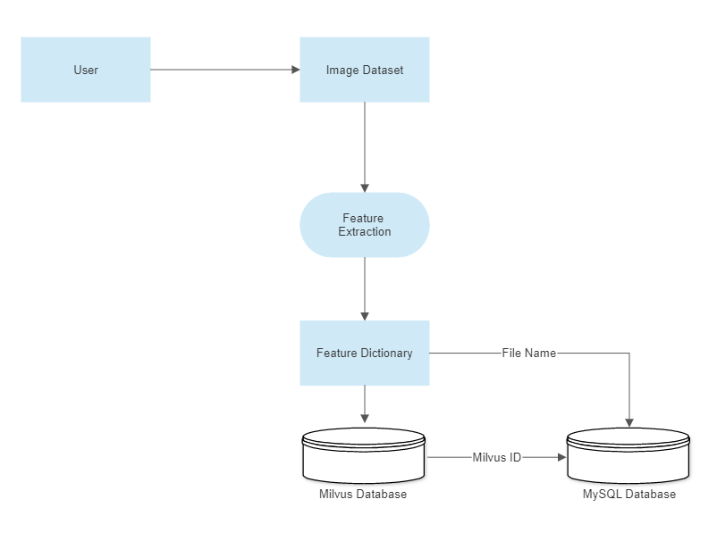

# Image-Similarity-Search
An Image Similarity Search Application developed under FrugalX using Python, Milvus, and MySQL

## Prerequisites
* [Milvus 2.0](https://milvus.io/docs/install_standalone-docker.md)
* [MySQL](https://hub.docker.com/r/mysql/mysql-server)
* [Python3](https://www.python.org/downloads/)
* [Docker](https://docs.docker.com/engine/install/)
* [Docker Compose](https://docs.docker.com/compose/install/)

Before running the application, make sure that Milvus server and MySQL server are up and running.

## Workflow
1. The python script [feature_extract.py](https://github.com/Harper2123/Image-Similarity-Search/blob/main/feature_extract.py) extracts the feature vectors from the images in the feat-test folder.
2. The python script [vector_database.py](https://github.com/Harper2123/Image-Similarity-Search/blob/main/vector_database.py) performs the following tasks:-
    1. Create a connection with the Milvus Database
    2. Creates a new collection or retrieves a stored collection.
    3. Indexes the collection on embeddings.
    4. Inserts the vectors into the collection, and auto generate Milvus IDs for them.
    5. Search for similar vectors based on the search metric 'IP'(Inner Product).
3. The python script [sql_helper.py](https://github.com/Harper2123/Image-Similarity-Search/blob/main/sql_helper.py) performs the following tasks:-
    1. Establish a connection with MySQL database.
    2. Create a Table image_vectors with two columns:-
        * image_name
        * milvus_id
    3. Stores the file names and their Milvus IDs in the table.
    4. Retrieves the file names from the table based on the Milvus IDs returned by the vector_database.py script search_vectors() method.
4. The vector_database script then uses these file names to display the similar images.  

## Workflow Diagram  

### Storing Images

